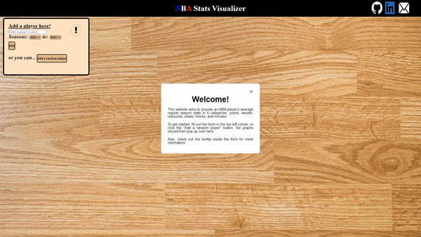

# NBA Stats Visualizer

[NBA Stats Visualizer](https://deli123.github.io/NBA-Stats-Visualizer/) aims to provide a player's average regular season
stats in 6 categories: points, assists, rebounds, steals, blocks, and minutes.  
These stats will be displayed in 6 different graphs for each corresponding category.

## Demo

## Features
- 6 distinct graphs for points, assists, rebounds, steals, blocks, and minutes
  - Hovering over a specific data point will display a small tooltip above it that shows the year, player, and stat number.
- The user can search for a player with a specific range of seasons
- *Add a random player* button that will randomly find a player and choose a random range of seasons

## Technologies, Libraries, APIs
- Chart.js to render line graphs
- [balldontlie API](https://www.balldontlie.io) to fetch player data
- Webpack and Babel to bundle and transpile JavaScript code

## Additional Information
Since this website uses the [balldontlie API](https://www.balldontlie.io) which only allows up to 60 requests per minute, some requests may not be fulfilled. Therefore, some graphs may have missing data points. If this happens, try decreasing the range of seasons or waiting a minute.  
  
The number of requests is equal to [**1 + (6 * *number of seasons*)**].  
(**1** fetch to check for a valid player) and (**6** fetches for each stat category * **number of seasons**)

Data for the years of which a player hasn't played a game in will be automatically filled with a zero.
For example, if the user wants to see the stats of **Lonzo Ball** for the **2015 - 2018** seasons, the stats for the **2015** and **2016** seasons will be filled with zeros. This is because Lonzo Ball hasn't played a game in those certain seasons.
